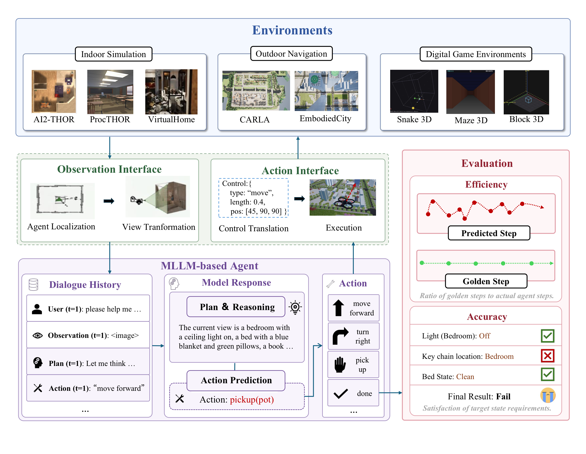
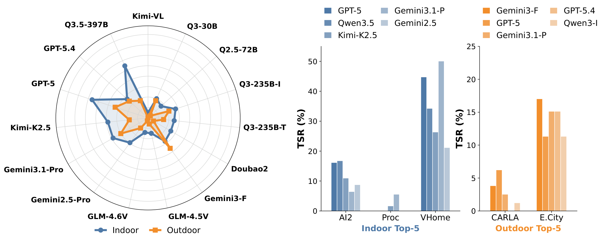
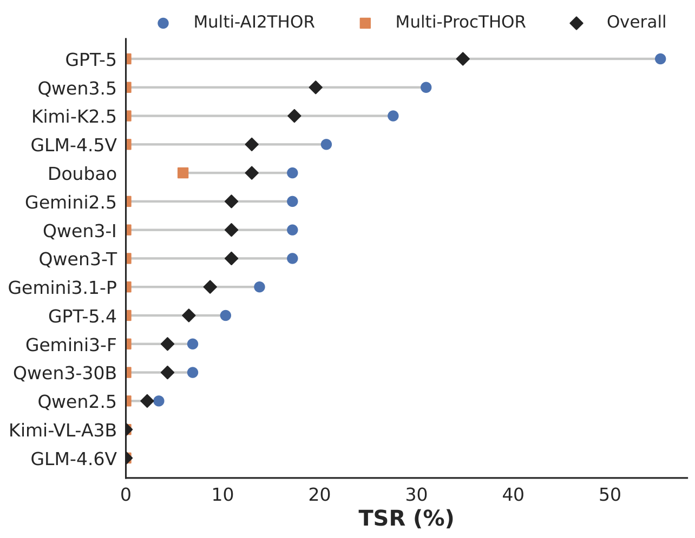

<div align="center">

# SpatialWorld

### Benchmarking Interactive Spatial Reasoning of Multimodal Agents in Real-World Tasks

[](pyproject.toml)
[](https://arxiv.org/abs/2606.09669)
[](https://spatial-world.github.io/)

**[Project Page](https://spatial-world.github.io/)** | **[Paper](https://arxiv.org/pdf/2606.09669)** | **[Data](https://github.com/Hongcheng-Gao/SpatialWorld/tree/main/data)**

</div>

## Abstract

Spatial reasoning is a foundational capability for multimodal large language models (MLLMs) to perceive and operate within the physical world. However, existing benchmarks predominantly rely on passive evaluation (e.g., static VQA) or simulator-specific pipelines, failing to assess general interactive spatial understanding. We introduce **SpatialWorld**, a unified benchmark for evaluating interactive spatial understanding of multimodal agents in complex real-world tasks.

Integrating eight heterogeneous simulation backends under a shared, simulator-agnostic protocol, SpatialWorld features **760 human-annotated tasks** across diverse domains (e.g., household routines, travel, social collaboration). Agents must solve tasks under vision-only partial observability, actively gathering egocentric visual evidence and expressing decisions via a unified, text-based action interface native to MLLMs. For reliable evaluation, each task includes a human-validated initial state, a reference trajectory, and a terminal-state verifier. Evaluating 15 advanced agents reveals that robust spatial task solving remains challenging: **GPT-5** achieves an average TSR of only **17.4%**, while the leading open-source model, **Qwen-3.5-397B-A17B**, reaches **14.1%**.

| 760 Tasks | 8 Backends | 6 Scenarios | 15 Models |
| :---: | :---: | :---: | :---: |
| Human-annotated | Simulation environments | Task categories | Evaluated MLLM agents |

## Benchmark Overview

SpatialWorld unifies diverse 3D backends under a standardized observation-action interface. Agents receive only a natural-language instruction and egocentric RGB observations, express decisions through a unified text-based action interface, and are evaluated with human-validated terminal-state verifiers.

<p align="center">
  <br>
  <em>SpatialWorld unifies eight 3D simulation backends under a shared closed-loop evaluation protocol.</em>
</p>

## Eight Simulation Backends

| Backend | Description | Tasks |
| --- | --- | ---: |
| **AI2-THOR** | Near-photorealistic indoor scenes with rich object affordances | 311 |
| **ProcTHOR** | Procedurally generated indoor layouts for layout generalization | 127 |
| **VirtualHome** | Daily activity scripts in home environments | 38 |
| **CARLA** | Urban traffic simulation for outdoor navigation | 80 |
| **EmbodiedCity** | Large-scale city navigation with realistic dynamics | 53 |
| **Multi-AI2THOR** | Multi-agent social collaboration in shared indoor scenes | 29 |
| **Multi-ProcTHOR** | Coordinated multi-agent tasks in procedural scenes | 17 |
| **3D Games** | Block 3D, Maze 3D, Snake, Rubik's Cube, etc. | 105 |

**Complexity levels** (parallel, not hierarchical): **Navigation** - reach targets via exploration; **Interaction** - object-level state changes; **Hybrid** - long-horizon navigation plus multi-step manipulation.

## Key Findings

- **Far from reliable 3D task solving.** Across the full benchmark, GPT-5 reaches only **17.4%** average TSR, while the strongest open-source model, Qwen-3.5-397B-A17B, reaches **14.1%**.
- **Physical tasks remain especially hard.** GPT-5 achieves **14.4%** Physical Overall TSR, followed by Qwen-3.5-397B-A17B at **12.2%**.
- **Success is not efficiency.** Models with comparable TSR can differ substantially in step efficiency (SE), indicating redundant exploration and task-dependent shortcuts.
- **Domain-specific strengths.** GPT-5 leads Daily (**14.9%**), Travel (**6.8%**), and Social Collaboration (**34.8%**); Qwen-3.5-397B-A17B ties GPT-5 in Work & Study (**16.9%**) and leads physical entertainment; Gemini-3.1-Pro leads digital 3D games (**39.0%** TSR).
- **Vision-only closed-loop evaluation.** Agents actively explore under partial observability using only egocentric RGB and a text-based action interface.

## Experimental Results

Full TSR / SE tables and task examples are on the **[project page](https://spatial-world.github.io/)**. Highlights below:

| Model | Physical Overall TSR | Digital 3D Games TSR | Notable Strength |
| --- | ---: | ---: | --- |
| GPT-5 | **14.4** | 36.4 | Best Daily, Travel, and Social Collaboration scores |
| Qwen-3.5-397B-A17B | 12.2 | 26.0 | Ties GPT-5 in Work & Study; leads physical entertainment |
| Gemini-3.1-Pro | 9.2 | **39.0** | Best digital 3D games performance |
| Kimi-K2.5 | 9.2 | 31.0 | Competitive social and game performance |

<p align="center">
  <br>
  <em>Indoor vs. Outdoor Performance - Top-5 Models</em>
</p>

<details>
<summary><strong>Scenario Distribution (click to expand)</strong></summary>

| Environment | Daily | Work | Entertain. | Travel | Social | Total |
| --- | ---: | ---: | ---: | ---: | ---: | ---: |
| AI2-THOR | 219 | 41 | 40 | 11 | 0 | 311 |
| ProcTHOR | 92 | 10 | 23 | 2 | 0 | 127 |
| VirtualHome | 27 | 8 | 3 | 0 | 0 | 38 |
| CARLA | 0 | 0 | 0 | 80 | 0 | 80 |
| EmbodiedCity | 12 | 0 | 2 | 39 | 0 | 53 |
| Multi-AI2THOR | 0 | 0 | 0 | 0 | 29 | 29 |
| Multi-ProcTHOR | 0 | 0 | 0 | 0 | 17 | 17 |
| 3D Games | 0 | 0 | 105 | 0 | 0 | 105 |
| **Total** | **350** | **59** | **173** | **132** | **46** | **760** |

</details>

<details>
<summary><strong>Multi-Agent Social Collaboration Profile (click to expand)</strong></summary>

<p align="center">
  
</p>

</details>

## About This Repository

SpatialWorld is a unified benchmark and toolkit for evaluating interactive
spatial reasoning of multimodal agents across AI2-THOR, ProcTHOR, CARLA,
VirtualHome, EmbodiedCity, and game environments.

The repository keeps one default config per environment under `configs/` for
standard evaluation. Model-specific and historical experiment configs are kept
separately under `experiments/configs/`, while experiment CSV files are kept under
`experiments/csv/`.

### Task Classification

Per-task scenario labels and complexity types are maintained in
[`task_classification_detail.csv`](task_classification_detail.csv) at the repository
root. Each row maps a `task_id` to:

| Column | Description |
| --- | --- |
| `environment` | Simulation backend (`ai2thor`, `procthor`, `carla`, etc.) |
| `task_id` | Task identifier used in benchmark CSV files |
| `instruction` | Natural-language task instruction |
| `category` | Scenario category: `Daily`, `Work`, `Entertain`, `Travel`, or `Social` |
| `task_type` | Complexity type: `Navigation`, `Interaction`, or `Hybrid` |

Task JSON files under `data/` intentionally omit legacy metadata fields
(`Evaluation_Type`, `Category`, `Level`); use the classification CSV as the
single source of truth for category breakdowns.

## Getting Started

See [Install](#install) for environment setup, then [Running Benchmarks](#running-benchmarks) to launch evaluation.

## Install

Install `uv` once if it is not already available:

```bash
curl -LsSf https://astral.sh/uv/install.sh | sh
```

Use the matching environment directory for the backend you want to run:

```bash
cd envs/ai2thor            # or: procthor / virtualhome / carla / embodiedcity / game
uv sync
source .venv/bin/activate
```

There is also a top-level grouped environment definition:

```bash
cd envs
uv sync --group ai2thor
```

The Python dependencies only prepare the client code. CARLA, VirtualHome, and
EmbodiedCity also require their simulator runtime, dataset, or Unreal/Unity
executable to be configured as described below.

## Project Structure

```text
SpatialWorld/
|-- actions/                # Unified action space and parsers
|-- configs/                # Default configs, one per environment
|   |-- ai2thor/dual/       # Default multi-agent AI2-THOR config
|   |-- procthor/dual/      # Default multi-agent ProcTHOR config
|   `-- embodiedcity/       # EmbodiedCity runtime templates
|-- data/                   # Task definitions, JSON data, game levels, assets
|-- envs/                   # uv environment definitions and env wrappers
|-- evaluation/             # Evaluation metrics and verifiers
|-- experiments/
|   |-- configs/            # Model-specific and historical configs
|   `-- csv/                # Experiment CSV files
|-- game/                   # Game environments and data generation scripts
|-- mllm_base_agent/        # Agent runner, LLM provider, prompts, env wrappers
|   `-- dual_agent/
|       |-- ai2thor/        # Multi-agent AI2-THOR implementation
|       `-- procthor/       # Multi-agent ProcTHOR implementation
|-- scripts/                # Environment CLI entry points
|   |-- ai2thor/            # `work/run_task.py` and `run_benchmark.py`
|   |-- procthor/           # `work/run_task.py` and `run_benchmark.py`
|   |-- carla/              # `work/run_task.py` and `run_benchmark.py`
|   |-- virtualhome/        # `work/run_task.py` and `run_benchmark.py`
|   |-- embodiedcity/       # `work/run_task.py`
|   `-- game/               # `run_benchmark.py`
|-- spatialworld/           # Package modules for shared runtime utilities
`-- tests/
```

Configuration files are grouped by environment. Dual-agent default configs are
kept under `configs/<environment>/dual/`; model-specific experiment configs and
CSV trackers stay under `experiments/`.

## Standard Evaluation Files

| Environment | CSV | Default Config |
| --- | --- | --- |
| AI2-THOR | `experiments/csv/ai2thor/Spatial-Annotation-ai2thor-gpt-5.csv` | `experiments/configs/ai2thor/config_close_gpt-5.yaml` |
| Multi-AI2-THOR | `experiments/csv/ai2thor/dual/Spatial-Annotation-ai2thor-Gemini-2.5-pro.csv` | `experiments/configs/ai2thor/dual/config_close_Gemini-2.5-pro.yaml` |
| ProcTHOR | `experiments/csv/procthor/Spatial-Annotation-procthor-gpt-5.csv` | `experiments/configs/procthor/config_close_gpt-5.yaml` |
| Multi-ProcTHOR | `experiments/csv/procthor/dual/Spatial-Annotation-procthor-Gpt-5p4.csv` | `experiments/configs/procthor/dual/config_close_Gpt-5p4.yaml` |
| CARLA | `experiments/csv/carla/Spatial-Annotation-carla-gpt-5.csv` | `experiments/configs/carla/config_close_gpt-5.yaml` |
| VirtualHome | `experiments/csv/virtualhome/Spatial-Annotation-virtualhome-gpt-5.csv` | `experiments/configs/virtualhome/config_close_gpt-5.yaml` |
| EmbodiedCity | `experiments/csv/embodiedcity/Spatial-Annotation-embodiedcity-gpt-5.4.csv` | `experiments/configs/embodiedcity/vln-agent-config-gpt54.yaml` |
| Game | `experiments/csv/game/*.csv` | `configs/game/*_config.py` |

Before evaluation, fill the target config's model block (`provider`,
`model_name`, `base_url`, `api_key`, temperature/token options) for your VLM
endpoint. To reproduce a model-specific experiment, use the matching config from
`experiments/configs/<environment>/`.

## Simulator Backends

### AI2-THOR

AI2-THOR does not require a separate simulator executable. Installing the
`ai2thor` dependency is enough; the package manages the Unity build used by
`ai2thor.controller.Controller`.

```bash
cd envs/ai2thor
uv sync
cd ../..
```

Key config file: `experiments/configs/ai2thor/config_close_gpt-5.yaml`.

Important fields include render size (`env.width`, `env.height`), camera FOV,
navigation grid size, visibility distance, platform/headless rendering, and
movement/rotation action settings.

Configure your VLM credentials before running. The OpenAI-compatible provider
uses `model.vlm.api_key` when set, otherwise it reads `OPENAI_API_KEY`; `base_url`
can also be supplied through `OPENAI_BASE_URL` when omitted from the config.
Do not commit real API keys to the default config.

Smoke test:

```bash
envs/ai2thor/.venv/bin/python -u -m scripts.ai2thor.work.run_task \
  --config experiments/configs/ai2thor/config_close_gpt-5.yaml \
  --scene FloorPlan1 \
  --tasks open_fridge
```

For machines without a display server, add `--headless` to the smoke-test
command. This sets `env.platform` to `CloudRendering` for the run.

### ProcTHOR

ProcTHOR uses AI2-THOR for rendering plus the ProcTHOR-10K house dataset.
Install the simulator dependency and `prior` through the ProcTHOR environment.

```bash
cd envs/procthor
uv sync
source .venv/bin/activate
```

Dataset reference: <https://github.com/allenai/procthor-10k>.

The code searches for the dataset in this order:

1. `PROCTHOR_DATASET_DIR`
2. `procthor/datasets/procthor-10k`
3. the local `prior` cache

To create a local dataset copy, either let `prior` download it on first run or
run:

```bash
python -c "import prior; dataset = prior.load_dataset('procthor-10k'); print(dataset.keys())"
```

If you keep the dataset outside the repo, point the scripts to it:

```bash
export PROCTHOR_DATASET_DIR=/data/procthor-10k
```

Key config file: `experiments/configs/procthor/config_close_gpt-5.yaml`.

Smoke test:

```bash
python -m scripts.procthor.work.run_task \
  --config experiments/configs/procthor/config_close_gpt-5.yaml \
  --scene-index 0 \
  --headless
```

Multi-agent ProcTHOR uses `experiments/configs/procthor/dual/config_close_gpt-5.yaml`.

### VirtualHome

VirtualHome requires the Python package and a Unity simulator executable.
Download the Unity simulator from the official VirtualHome repository or release
links, unzip it, and set the executable path in the config or environment.

Official repository: <https://github.com/xavierpuigf/virtualhome>.

UnitySimulator v2.3.0 downloads:

- Windows: <http://virtual-home.org/release/simulator/v2.3.0/windows_exec.zip>
- macOS: <http://virtual-home.org/release/simulator/v2.3.0/macos_exec.zip>
- Linux: <http://virtual-home.org/release/simulator/v2.3.0/linux_exec.zip>

```bash
cd envs/virtualhome
uv sync
source .venv/bin/activate
```

Edit `experiments/configs/virtualhome/config_close_gpt-5.yaml`:

```yaml
env:
  url: null
  port: "8080"
  backend_exe: "/path/to/VirtualHome.exe"
  backend_args: "-windowed -screen-width 960 -screen-height 540"
  backend_startup_timeout: 90
```

The launcher resolves the executable in this priority order: CLI
`--backend-exe`, `VIRTUALHOME_EXE` / `VH_BACKEND_EXE`, config
`env.backend_exe`, then common repo-local fallback paths. `env.backend_args` can
also be overridden by `--backend-args` or `VH_BACKEND_ARGS`.

Smoke test:

```bash
python -m scripts.virtualhome.work.run_task \
  --config experiments/configs/virtualhome/config_close_gpt-5.yaml \
  --scene 0
```

For batch evaluation, keep `--workers 1` unless you intentionally run multiple
VirtualHome backend instances on different ports.

### CARLA

CARLA requires the Python API package and a separate CARLA server process. This
repo targets CARLA 0.9.16, so use the matching simulator package for the server.

Release page: <https://github.com/carla-simulator/carla/releases/tag/0.9.16>.

Downloads:

- Windows: <https://tiny.carla.org/carla-0-9-16-windows>
- Ubuntu: <https://tiny.carla.org/carla-0-9-16-linux>

```bash
cd envs/carla
uv sync
source .venv/bin/activate
```

Start the server before launching SpatialWorld scripts:

```bash
# Linux, from the extracted CARLA directory
./CarlaUE4.sh -carla-rpc-port=2000 -quality-level=Low
```

```powershell
# Windows, from the extracted CARLA directory
.\CarlaUE4.exe -carla-rpc-port=2000 -quality-level=Low
```

If `pip install carla==0.9.16` is not available for your OS/Python combination,
install the wheel or egg shipped under the extracted CARLA `PythonAPI/carla/dist/`
directory.

Key config file: `experiments/configs/carla/config_close_gpt-5.yaml`. Keep `env.port` aligned with the
server's `-carla-rpc-port`, usually `2000`.

Smoke test:

```bash
python -m scripts.carla.work.run_task \
  --config experiments/configs/carla/config_close_gpt-5.yaml \
  --map Town01
```

Keep batch runs at `--workers 1` unless you are running separate CARLA servers on
separate ports.

### EmbodiedCity

EmbodiedCity is backed by an AirSim-compatible Unreal simulator. Install the
Python dependencies, then start the simulator executable supplied with the
EmbodiedCity release before running the agent.

AirSim references: <https://microsoft.github.io/AirSim/apis/> and
<https://github.com/microsoft/AirSim/releases>.

```bash
cd envs/embodiedcity
uv sync
source .venv/bin/activate
```

Start the Windows simulator executable before running evaluation. The repository
ships an AirSim FPV template at `configs/embodiedcity/settings_fpv.json`. From the
repository root, pass that repo-relative settings path to `TrafficSimulation.exe`:

```powershell
# Run from the repository root, or prefix the executable with its extracted path.
.\TrafficSimulation.exe -settings="configs\embodiedcity\settings_fpv.json"
```

If you start the executable from another working directory, keep the same repo
file but pass its absolute path instead. The runner expects the AirSim multirotor
vehicle to be named `Drone1`. When closing the simulator, stop the
`TrafficSimulation.exe` process completely before the next run; otherwise the next
client may fail to connect.

VLN evaluation uses model-specific configs under
`experiments/configs/embodiedcity/`:

```bash
python -m scripts.embodiedcity.work.run_task \
  --config experiments/configs/embodiedcity/qwen3-vl-30b-a3b-instruct.yaml
```

### Game

The game tasks are local Python/Pygame/OpenGL environments and do not require a
separate simulator process.

```bash
cd envs/game
uv sync
source .venv/bin/activate
```

Smoke tests:

```bash
python game/examples/demo.py
python -m scripts.game.run_benchmark
```

Game defaults are Python config files under `configs/game/`.

## Running Benchmarks

### AI2-THOR

```bash
envs/ai2thor/.venv/bin/python -u -m scripts.ai2thor.run_benchmark \
  --csv experiments/csv/ai2thor/Spatial-Annotation-ai2thor.csv \
  --config experiments/configs/ai2thor/config_close_gpt-5.yaml \
  --save-name standard \
  --headless --workers 1 \
  --task ai2thor03017
```

Start with `--workers 1 --task <task_id>` to verify one case, then remove
`--task` and increase `--workers` when your API endpoint supports concurrency.

### Multi-AI2-THOR

```bash
python -m mllm_base_agent.dual_agent.ai2thor.run_benchmark \
  --csv experiments/csv/ai2thor/dual/Spatial-Annotation-ai2thor-Gemini-2.5-pro.csv \
  --config experiments/configs/ai2thor/dual/config_close_gpt-5.yaml \
  --save-name standard-dual \
  --workers 2
```

### ProcTHOR

```bash
python -m scripts.procthor.run_benchmark \
  --csv experiments/csv/procthor/Spatial-Annotation-procthor.csv \
  --config experiments/configs/procthor/config_close_gpt-5.yaml \
  --save-name standard \
  --headless --workers 4
```

ProcTHOR looks for the dataset in `PROCTHOR_DATASET_DIR`,
`procthor/datasets/procthor-10k`, or the local `prior` cache.

### Multi-ProcTHOR

```bash
python -m mllm_base_agent.dual_agent.procthor.run_benchmark \
  --csv experiments/csv/procthor/dual/Spatial-Annotation-procthor-Gpt-5p4.csv \
  --config experiments/configs/procthor/dual/config_close_gpt-5.yaml \
  --save-name standard-dual \
  --headless --workers 2
```

### VirtualHome

```bash
python -m scripts.virtualhome.run_benchmark \
  --csv experiments/csv/virtualhome/Spatial-Annotation-virtualhome.csv \
  --config experiments/configs/virtualhome/config_close_gpt-5.yaml \
  --save-name standard \
  --workers 1
```

### CARLA

```bash
python -m scripts.carla.run_benchmark \
  --csv experiments/csv/carla/Spatial-Annotation-carla.csv \
  --config experiments/configs/carla/config_close_gpt-5.yaml \
  --save-name standard \
  --workers 1 --headless
```

Start the CARLA server before running the benchmark.

### EmbodiedCity

```bash
python -m scripts.embodiedcity.work.run_task \
  --config experiments/configs/embodiedcity/qwen3-vl-30b-a3b-instruct.yaml
```

By convention, all run artifacts should live under `outputs/`. AI2-THOR,
ProcTHOR, CARLA, and VirtualHome benchmark scripts create timestamped run
directories under their `--output-dir` root, which defaults to `outputs`.
EmbodiedCity writes each task directory, `result.json`, optional `fpv.mp4`, and
`summary_*.json` under the config's `output.save_dir`; the provided experiment
configs use `outputs/embodiedcity/<model>`. Game benchmark summaries are written
under the game runner's log/output directory.

### Game

```bash
python -m scripts.game.run_benchmark
```

The game runner calls the per-game evaluation scripts and then automatically
runs `scripts/analyze_and_export.py`, producing `results_summary.csv` in the
game output directory.

## Evaluation Protocol

- Model actions use the unified action space from the paper: `Move`, `Rotate`,
  `Tilt`, `ChangePosture`, `Pick`, `Place`, `ChangeState`, `Manipulate`,
  `EndTask`, and `Communicate`.
- The action parser maps unified actions to simulator-native commands.
- The step budget for each task is dynamically determined as **2g + 10**, where **g** is the golden action count annotated by human annotators.
- Main experiments use temperature **τ = 1.0** and retain the latest **w = 30** turns of interaction as context.
- Each model is prompted with the egocentric RGB screenshot and a natural-language task description at every step; no privileged state information is provided.
- Metrics include Task Success Rate (TSR) and Step Efficiency (SE).
- Evaluation uses terminal-state verification rather than trajectory matching.

### Aggregating Results by Category

After a benchmark run finishes, each environment writes a results CSV with
`Task ID` and `Completed` columns (`true` / `false` / `null`). Use
`scripts/aggregate_results_by_category.py` to join that CSV with
`task_classification_detail.csv` and compute TSR per scenario category,
complexity type, and environment:

```bash
python scripts/aggregate_results_by_category.py \
  --results experiments/csv/ai2thor/Spatial-Annotation-ai2thor-gpt-5.csv \
  --classification task_classification_detail.csv \
  --output outputs/ai2thor-gpt-5-category-summary.csv
```

Pending tasks (`Completed` is `null` or empty) are excluded from the TSR
denominator. The script also prints an overall summary to stdout.

## Notes

On Windows, prefer Windows Terminal or PowerShell 7. If Chinese output looks
garbled, run `chcp 65001` and set `PYTHONUTF8=1` before launching scripts.

Before running any benchmark, set the model provider, model name, base URL, and
API key in the standard config file for the target environment.

## Citation

If you find SpatialWorld helpful, please cite:

```bibtex
@misc{gao2026spatialworldbenchmarkinginteractivespatial,
  title={SpatialWorld: Benchmarking Interactive Spatial Reasoning of Multimodal Agents in Real-World Tasks},
  author={Hongcheng Gao and Hailong Qu and Jingyi Tang and Jiahao Wang and Zihao Huang and Hengkang Qiao and Shihong Huang and Junming Yang and Yi Li and Hongyixuan Yuan and Wenjie Li and Bohan Zeng and Wenbo Li and Bo Wang and Jianhui Liu and Olive Huang and Haoyang Huang and Wentao Zhang and Guoqing Huang and Nan Duan and Yinpeng Dong},
  year={2026},
  eprint={2606.09669},
  archivePrefix={arXiv},
  primaryClass={cs.AI},
  url={https://arxiv.org/abs/2606.09669}
}
```

## Acknowledgement

SpatialWorld builds on the open-source embodied-AI and simulation ecosystem. We
especially thank the authors and maintainers of
[AI2-THOR](https://ai2thor.allenai.org/),
[ProcTHOR](https://procthor.allenai.org/),
[VirtualHome](https://github.com/xavierpuigf/virtualhome),
[CARLA](https://carla.org/),
[EmbodiedCity](https://github.com/EmbodiedCity/EmbodiedCity),
and [AirSim](https://microsoft.github.io/AirSim/).
