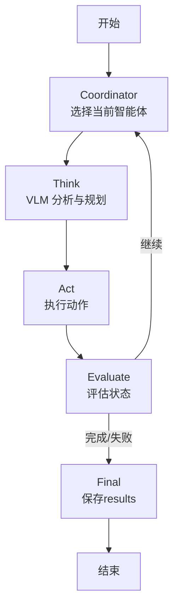

# Dual-Agent Spatial Planning 双智能体协作系统

## 📖 概述

Dual-Agent Spatial Planning 是基于主目录单智能体框架扩展的**双智能体协作系统**。两个具身智能体在共享的 3D 虚拟环境（AI2-THOR）中通过**显式通信**协作完成任务。

### 核心设计理念

```
┌─────────────────────────────────────────────────────────────┐
│                    共享环境 (AI2-THOR)                       │
│  ┌─────────────────┐              ┌─────────────────┐       │
│  │    Agent 1      │◄────────────►│    Agent 2      │       │
│  │  (Collaborator) │  COMMUNICATE │  (Collaborator) │       │
│  └────────┬────────┘              └────────┬────────┘       │
│           │                                │                │
│           ▼                                ▼                │
│      观察环境                          观察环境              │
│      执行动作                          执行动作              │
└─────────────────────────────────────────────────────────────┘
```

**关键特性：**
- 🤝 **平等协作**：两个智能体地位平等，无主从之分
- 📨 **显式通信**：智能体只能通过 `<COMMUNICATE>` 标签交流，无法"偷看"对方的观察
- 🔄 **交替执行**：智能体轮流执行动作，模拟真实协作场景
- 🎯 **共同目标**：完成同一个任务，需要分工与协调

## 🏗️ 系统架构

### 与单智能体版本的对比

| 特性 | 单智能体 | 双智能体 |
|------|----------|----------|
| 状态定义 | `AgentState` | `DualAgentState` (包含两个 `AgentState`) |
| 状态机节点 | Think → Act → Evaluate | Coordinator → Think → Act → Evaluate |
| 信息流 | 单一轨迹 | 两条独立轨迹 + 通信历史 |
| Prompt | 单一 System Prompt | 协作导向的 System Prompt |

### 模块复用关系

双智能体系统**复用**主目录的以下模块（不重复实现）：
- `envs/ai2thor/wrapper.py` - 环境封装
- `evaluators/base.py` - 任务评估器
- `config/load_config.py` - 配置加载
- `core/llm/schemas.py` - 数据结构

双智能体系统**扩展**的模块：
- `dual_agent/core/agent/graph.py` - 双智能体状态机
- `dual_agent/core/agent/state.py` - 双智能体状态定义
- `dual_agent/core/prompts/dual_agent.py` - 协作 Prompt

### 状态机流程



### 项目结构

```
dual_agent/
├── main.py               # 主入口（推荐使用）
├── config.yaml           # 默认配置
├── configs/              # 配置文件目录
│   └── equal_collaboration.yaml
├── core/
│   ├── agent/
│   │   ├── graph.py      # 双智能体状态机（核心）
│   │   └── state.py      # 状态定义
│   ├── llm/
│   │   └── __init__.py   # VLM 初始化
│   ├── prompts/
│   │   └── dual_agent.py # 协作 Prompt 模板
│   └── memory/
│       └── __init__.py   # 双智能体记忆管理
├── docs/                 # 文档
├── outputs/              # 运行输出
└── tasks/                # 任务定义（可选）
```

## 🚀 快速开始

### 1. 环境准备

```bash
# 确保在项目根目录
cd spatial-planning

# 激活环境
conda activate spatial

# 配置 API Key（在 dual_agent/.env 中）
echo "OPENAI_API_KEY=your_key_here" > dual_agent/.env
echo "OPENAI_BASE_URL=http." >> dual_agent/.env
```

### 2. 运行单个任务

```bash
# 使用默认配置运行任务
python mllm_base_agent/dual_agent/ai2thor/main.py --task ai2thor05041

# 设置最大步数
python mllm_base_agent/dual_agent/ai2thor/main.py --task ai2thor05041 --max-steps 40

# 设置智能体切换间隔
python mllm_base_agent/dual_agent/ai2thor/main.py --task ai2thor05041 --switch-interval 5
```

### 3. 运行多个任务

```bash
python mllm_base_agent/dual_agent/ai2thor/main.py --task ai2thor05001 ai2thor050002 ai2thor05003
```

### 4. 查看results

运行results保存在 `dual_agent/outputs/task_{task_id}_{timestamp}/` 目录下：
- `dual_episode_*.json`：完整的运行日志，包含轨迹、通信历史等
- `step_*.png`：每一步的视角截图

## 📝 配置说明

### 主配置文件 `dual_agent/config.yaml`

```yaml
# 环境配置
env:
  type: ai2thor
  scene: FloorPlan1
  width: 800
  height: 600

# 双智能体专用配置
dual_agent:
  equal_collaboration: true     # 平等协作模式
  collaboration_mode: alternating  # 交替执行
  switch_interval: 1            # 每1步切换智能体
  max_global_steps: 60          # 总步数上限

# 模型配置
model:
  vlm:
    model_name: gpt-4o
    temperature: 0.2
```

### 配置选项详解

| 配置项 | 说明 | 默认值 |
|--------|------|--------|
| `equal_collaboration` | 是否启用平等协作模式 | `true` |
| `collaboration_mode` | 协作模式：`alternating`（交替）或 `sequential`（顺序） | `alternating` |
| `switch_interval` | 交替模式下的切换间隔 | `1` |
| `max_global_steps` | 两个智能体的总步数上限 | `60` |

## 🔧 核心实现细节

### 1. 智能体通信机制

智能体只能通过 `<COMMUNICATE>` 标签互相交流：

```xml
<THINK>
我看到了书桌上有一本书，需要告诉我的搭档。
</THINK>
<ACTION>
RotateRight
</ACTION>
<COMMUNICATE>
我在书桌上发现了一本书，位置在房间的右侧。你能帮忙打开它吗？
</COMMUNICATE>
```

### 2. 信息隔离原则

**设计原则**：两个智能体无法直接访问对方的观察results，只能通过通信了解对方的发现。

```python
# ❌ 不允许：自动共享发现的物体
# state["shared_memory"]["discovered_objects"][obj_type].append(pos)

# ✅ 允许：通过通信共享
state["communication_history"].append({
    "sender": current_agent_id,
    "receiver": other_agent_id,
    "message": communication_message,
})
```

### 3. 状态定义

```python
class DualAgentState(TypedDict):
    # 任务相关
    task_prompt: str
    
    # 智能体状态
    agent_1: AgentState
    agent_2: AgentState
    current_agent: str  # "agent_1" or "agent_2"
    
    # 通信
    communication_history: List[Dict]  # 通信记录
    message_queue: List[Dict]          # 待处理消息
    
    # 全局控制
    global_step_count: int
    max_global_steps: int
    global_success: bool
```

### 4. Coordinator 节点

负责决定下一个执行的智能体：

```python
def coordinator_node(state: DualAgentState) -> DualAgentState:
    # 检查切换条件
    if current_turn_steps >= switch_interval:
        # 切换到另一个智能体
        state["current_agent"] = other_agent_id
        state["current_turn_steps"] = 0
    return state
```

## 📊 输出格式

### Episode JSON 结构

```json
{
  "task": "打开书并关闭台灯",
  "scene": "FloorPlan302",
  "mode": "dual_agent",
  "success": true,
  "global_step_count": 25,
  "agent_1_steps": 13,
  "agent_2_steps": 12,
  "trajectory": [
    {
      "step": 0,
      "agent_id": "agent_1",
      "thinking": "...",
      "action_string": "RotateRight",
      "communication": "我看到书桌在右边..."
    }
  ],
  "communication_history": [
    {
      "sender": "agent_1",
      "receiver": "agent_2",
      "message": "我看到书桌在右边...",
      "step": 0
    }
  ]
}
```

## ⚠️ 注意事项

1. **通信开销**：过于频繁的通信可能消耗步数，需要平衡
2. **任务分工**：复杂任务建议在 Prompt 中引导智能体明确分工
3. **错误处理**：当一个智能体声称 DONE 但验证失败时，系统会自动切换到另一个智能体继续

## 🔗 相关文档

- [架构设计](architecture.md)
- [API 参考](api_reference.md)
