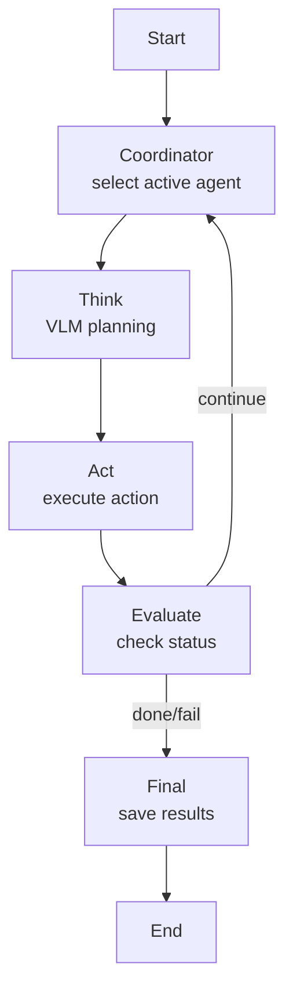

# Dual-Agent Spatial Planning

## Overview

Dual-Agent Spatial Planning extends the single-agent framework with a **two-agent collaboration system**. Two embodied agents work in a shared 3D virtual environment (AI2-THOR) and complete tasks through **explicit communication**.

### Core Design

```
┌─────────────────────────────────────────────────────────────┐
│                    Shared Environment (AI2-THOR)              │
│  ┌─────────────────┐              ┌─────────────────┐       │
│  │    Agent 1      │◄────────────►│    Agent 2      │       │
│  │  (Collaborator) │  COMMUNICATE │  (Collaborator) │       │
│  └────────┬────────┘              └────────┬────────┘       │
│           │                                │                │
│           ▼                                ▼                │
│      Observe env                      Observe env           │
│      Execute action                   Execute action        │
└─────────────────────────────────────────────────────────────┘
```

**Key properties:**
- **Equal collaboration**: both agents are peers; there is no master/slave hierarchy
- **Explicit communication**: agents exchange information only through `<COMMUNICATE>` tags
- **Alternating execution**: agents take turns, simulating real collaboration
- **Shared goal**: both agents work on the same task and must coordinate

## System Architecture

### Comparison with Single-Agent Mode

| Feature | Single-Agent | Dual-Agent |
|------|----------|----------|
| State | `AgentState` | `DualAgentState` (two `AgentState` instances) |
| Graph nodes | Think → Act → Evaluate | Coordinator → Think → Act → Evaluate |
| Information flow | Single trajectory | Two trajectories + communication history |
| Prompt | Single system prompt | Collaboration-oriented system prompt |

### Module Reuse

The dual-agent system **reuses** these main-repo modules:
- `envs/ai2thor/wrapper.py` — environment wrapper
- `evaluators/base.py` — task evaluator
- `config/load_config.py` — config loading
- `core/llm/schemas.py` — shared schemas

The dual-agent system **extends**:
- `dual_agent/core/agent/graph.py` — dual-agent state machine
- `dual_agent/core/agent/state.py` — dual-agent state definitions
- `dual_agent/core/prompts/dual_agent.py` — collaboration prompts

### State Machine Flow



### Project Layout

```
dual_agent/
├── main.py               # Main entry point
├── config.yaml           # Default config
├── configs/
│   └── equal_collaboration.yaml
├── core/
│   ├── agent/
│   │   ├── graph.py      # Dual-agent state machine
│   │   └── state.py      # State definitions
│   ├── llm/
│   │   └── __init__.py   # VLM initialization
│   ├── prompts/
│   │   └── dual_agent.py # Collaboration prompt templates
│   └── memory/
│       └── __init__.py   # Dual-agent memory
├── docs/
├── outputs/
└── tasks/
```

## Quick Start

### 1. Environment Setup

```bash
cd spatial-planning

conda activate spatial

echo "OPENAI_API_KEY=your_key_here" > dual_agent/.env
echo "OPENAI_BASE_URL=http." >> dual_agent/.env
```

### 2. Run a Single Task

```bash
python mllm_base_agent/dual_agent/ai2thor/main.py --task ai2thor05041

python mllm_base_agent/dual_agent/ai2thor/main.py --task ai2thor05041 --max-steps 40

python mllm_base_agent/dual_agent/ai2thor/main.py --task ai2thor05041 --switch-interval 5
```

### 3. Run Multiple Tasks

```bash
python mllm_base_agent/dual_agent/ai2thor/main.py --task ai2thor05001 ai2thor050002 ai2thor05003
```

### 4. Inspect Outputs

Runs are saved under `dual_agent/outputs/task_{task_id}_{timestamp}/`:
- `dual_episode_*.json`: full run log with trajectories and communication history
- `step_*.png`: per-step egocentric screenshots

## Configuration

### Main Config `dual_agent/config.yaml`

```yaml
env:
  type: ai2thor
  scene: FloorPlan1
  width: 800
  height: 600

dual_agent:
  equal_collaboration: true
  collaboration_mode: alternating
  switch_interval: 1
  max_global_steps: 60

model:
  vlm:
    model_name: gpt-4o
    temperature: 0.2
```

### Config Options

| Option | Description | Default |
|--------|------|--------|
| `equal_collaboration` | Enable equal-collaboration mode | `true` |
| `collaboration_mode` | `alternating` or `sequential` | `alternating` |
| `switch_interval` | Steps before switching agents in alternating mode | `1` |
| `max_global_steps` | Global step budget for both agents | `60` |

## Implementation Details

### 1. Communication

Agents communicate only through `<COMMUNICATE>`:

```xml
<THINK>
I see a book on the desk and should tell my partner.
</THINK>
<ACTION>
RotateRight
</ACTION>
<COMMUNICATE>
I found a book on the desk on the right side of the room. Can you open it?
</COMMUNICATE>
```

### 2. Information Isolation

Agents cannot directly access each other's observations; they learn about the partner only through messages.

```python
# Not allowed: auto-sharing discovered objects
# state["shared_memory"]["discovered_objects"][obj_type].append(pos)

# Allowed: sharing through communication
state["communication_history"].append({
    "sender": current_agent_id,
    "receiver": other_agent_id,
    "message": communication_message,
})
```

### 3. State Definition

```python
class DualAgentState(TypedDict):
    task_prompt: str
    agent_1: AgentState
    agent_2: AgentState
    current_agent: str  # "agent_1" or "agent_2"
    communication_history: List[Dict]
    message_queue: List[Dict]
    global_step_count: int
    max_global_steps: int
    global_success: bool
```

### 4. Coordinator Node

Selects the next active agent:

```python
def coordinator_node(state: DualAgentState) -> DualAgentState:
    if current_turn_steps >= switch_interval:
        state["current_agent"] = other_agent_id
        state["current_turn_steps"] = 0
    return state
```

## Output Format

### Episode JSON

```json
{
  "task": "Open the book and turn off the desk lamp",
  "scene": "FloorPlan302",
  "mode": "dual_agent",
  "success": true,
  "global_step_count": 25,
  "agent_1_steps": 13,
  "agent_2_steps": 12,
  "trajectory": [
    {
      "step": 0,
      "agent_id": "agent_1",
      "thinking": "...",
      "action_string": "RotateRight",
      "communication": "I see the desk on the right..."
    }
  ],
  "communication_history": [
    {
      "sender": "agent_1",
      "receiver": "agent_2",
      "message": "I see the desk on the right...",
      "step": 0
    }
  ]
}
```

## Notes

1. Frequent communication can consume the step budget; balance coordination and efficiency
2. For complex tasks, guide agents to divide labor explicitly in the prompt
3. If one agent outputs DONE but verification fails, control switches to the other agent

## Related Docs

- [Architecture](architecture.md)
- [API Reference](api_reference.md)
